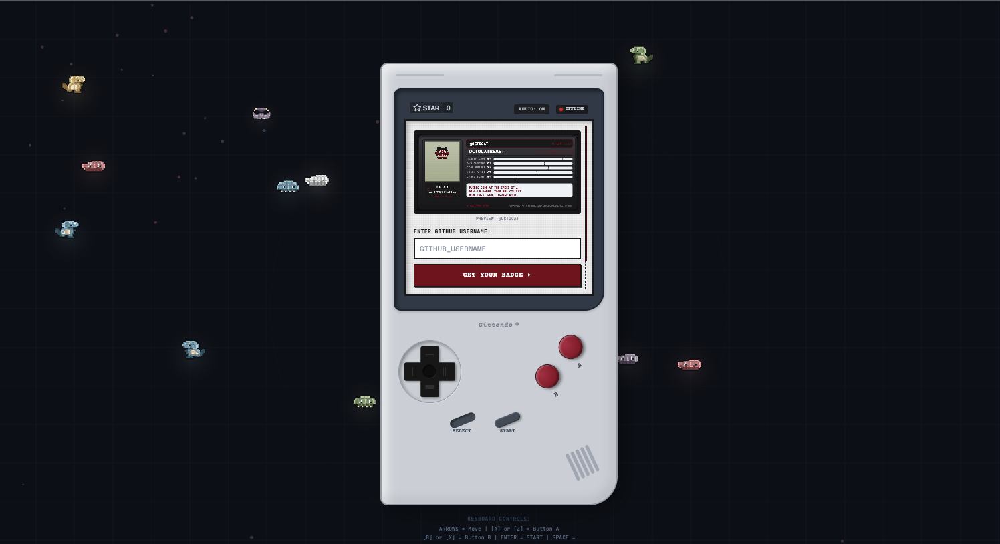
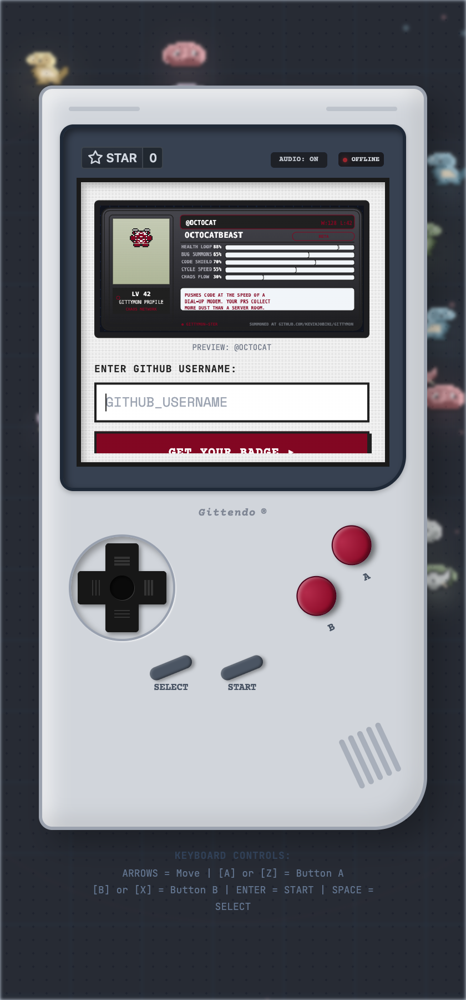
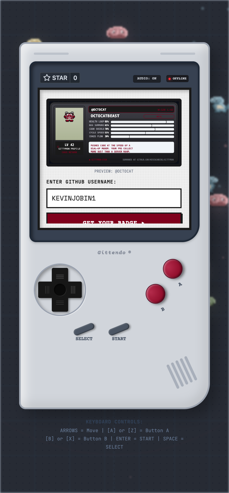
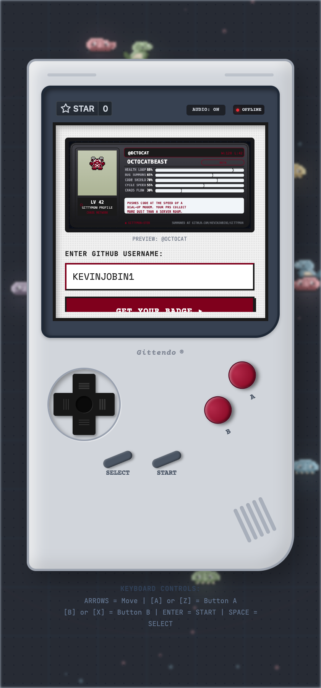
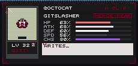

<div align="center">

</div>

<p align="center">
  <strong>🐛 Turn any GitHub profile into a savage 8-bit Roast-mon monster — battle bugs, fight AI bosses, and climb the leaderboard. All inside a retro Gameboy shell.</strong>
</p>

<p align="center">
  <a href="#features">Features</a> •
  <a href="#quick-start">Quick Start</a> •
  <a href="#api-endpoints">API</a> •
  <a href="#tech-stack">Tech Stack</a> •
  <a href="#embed-cards">Embed Cards</a>
</p>

<p align="center">
  <br />
  <em>Summon your monster, check stats, battle bugs, and climb the leaderboard — all inside a faithful Gameboy shell.</em>
</p>

<br />

### 🎬 Live Demo

<p align="center">
  <video src="https://github.com/user-attachments/assets/6be20de4-3669-45ac-8e85-6b4caa328a91" alt="Gittymon Video Summon Your Monster" width="100%" style="max-width: 390px; border-radius: 12px; border: 2px solid #1a1a1a;" />
  <br />
  <em>Full flow: enter a GitHub username → press SUMMON → watch your Roast-mon come to life!</em>
</p>

<br />

### 📸 Flow Screenshots

<p align="center">
  
  
  
  <br />
  <em>1. Enter a GitHub username → 2. Press SUMMON → 3. Get your Roast-mon!</em>
</p>

---

## Overview

**Gittymon** is a web app that mashes up GitHub profiles, procedurally generated pixel art, AI-powered roasts (via Groq Llama 3), and retro Gameboy aesthetics. Enter a GitHub username and the app summons a unique "Roast-mon" monster — complete with stats, moves, a savage roast, and a custom 8-bit sprite — then lets you battle it in a Gameboy-styled arena.

Built as a single-page app with an Express/Vite server, WebSocket multiplayer, and a full retro audio engine.

---

## Features

| Feature | Description |
|---------|-------------|
| **🎮 Gameboy Shell UI** | Authentic Nintendo Gameboy-styled chassis with D-pad + A/B buttons. Keyboard: arrows, Z/A, X/B, Enter, Space. |
| **👾 Summon System** | Enter a GitHub username → fetches profile data → AI generates a custom monster with stats, moves, and a roast. Cached to disk so repeated lookups skip the AI. |
| **⚔️ Local Battle** | Fight procedurally generated bug monsters (Merge Conflict, Null Pointer, etc.) with turn-based combat. |
| **🌐 PvP Arena** | Real-time WebSocket multiplayer. If no opponent is found, sarcastic retro bots step in. Leaderboard tracks win/loss records. |
| **🤖 AI Boss Battle** | Face "CYBER-DRAKE-Y2K" (LV 99 Arch-Glitch) — every turn hits the Groq API for a dynamically generated roast commentary. |
| **🖼️ Embed Cards** | Export your Roast-mon as an SVG or animated GIF card for GitHub READMEs. Includes a `/card/:username` social share page with Open Graph tags. |
| **🏅 Leaderboard** | Preseeded with coding legends (Woz, Torvalds, Lovelace, Hamilton, Gosling). New challengers auto-added on match results. |
| **🔊 Chiptune Engine** | Real-time Web Audio API generative chiptune music — switches between normal and battle-intensity patterns with kick/snare percussion. |
| **📟 8-bit Sprite Engine** | Procedurally generated pixel-art monsters using seeded LCG randomness. Horns, eyes, limbs, and body shapes vary per seed. |
| **💾 Summon Cache** | Repeated lookups for the same GitHub username serve the cached result instantly — no AI call, no GitHub API call. |
| **🛡️ Shields.io Badge** | Dynamic badge endpoint showing rank and level for any username — embeddable in GitHub profiles. |

---

## Quick Start

### Prerequisites

- **Node.js** 18+
- A free **Groq API key** from [console.groq.com](https://console.groq.com) (free tier: ~14k requests/day, Llama 3.3 70B + Llama 3.1 8B)

### Setup

```bash
# 1. Clone & install
git clone https://github.com/kevinjobin1/Gittymon.git
cd Gittymon
npm install

# 2. Create .env with your Groq API key
echo 'GROQ_API_KEY="gsk_your_key_here"' > .env

# 3. Run
npm run dev
```

The app starts at **`http://localhost:3000`**.

### Environment Variables

| Variable | Required | Description |
|----------|----------|-------------|
| `GROQ_API_KEY` | Yes | Groq API key for Llama 3 AI generation |
| `APP_URL` | No | Public URL for self-referential links (auto-injected on AI Studio) |

### Scripts

| Command | Description |
|---------|-------------|
| `npm run dev` | Start dev server with hot-reload (uses `tsx`) |
| `npm run build` | Build Vite frontend + bundle server with esbuild |
| `npm start` | Run production server from `dist/` |
| `npm run lint` | TypeScript type-check (`tsc --noEmit`) |

---

## Tech Stack

| Layer | Technology |
|-------|-----------|
| **Frontend** | React 19, TypeScript, Tailwind CSS v4, Vite 6 |
| **Server** | Express.js, `tsx` (dev), esbuild (production bundle) |
| **AI** | Groq API (Llama 3.3 70B for summon JSON, Llama 3.1 8B for boss roasts) |
| **Real-time** | WebSocket via `ws` library |
| **Audio** | Web Audio API — procedural chiptune synthesis |
| **Images** | Procedural pixel art (canvas 2D), `gifenc` for animated GIF cards |
| **Animations** | CSS3 keyframes + Tailwind transitions |
| **Icons** | Lucide React |

---

## API Endpoints

### `POST /api/summon`
Summon a Roast-mon from a GitHub username.

```json
{ "username": "octocat" }
```
Optional: `{ "username": "octocat", "refresh": true }` to bypass cache and regenerate.

### `GET /api/leaderboard`
Returns the full leaderboard sorted by wins (descending), top 50.

### `POST /api/ai-boss-comment`
Generates a dynamic roast from the AI boss during battle.

```json
{
  "username": "octocat",
  "monName": "CommitoBat",
  "stats": { "hp": 80, "attack": 65, "defense": 50, "speed": 70, "chaos": 40 },
  "action": "FIGHT: Git Commit Force",
  "bossHP": 200
}
```

### `GET /api/embed/svg/:username`
Returns an SVG card (460×220) with sprite, stats, and roast. Use as an image in READMEs.

```

```

### `GET /api/embed/gif/:username`
Returns an animated GIF version of the card (same dimensions, 10 frames with sprite bounce + typewriter roast).

```

```

### `GET /api/badge/:username`
Returns a [shields.io](https://shields.io/) compatible JSON endpoint for dynamic badges.

```
https://img.shields.io/endpoint?url=https://your-app.com/api/badge/octocat&style=for-the-badge
```

**Live example for @kevinjobin1 (LV 40):**

```
https://img.shields.io/badge/Gittymon-LV%2040-7f001c?style=for-the-badge&logo=github&logoColor=e2dfde
```

### `GET /card/:username`
Full HTML page with Open Graph / Twitter Card meta tags. Designed for social sharing — renders the animated GIF with stats, type badge, and roast.

---

## Embed Cards

Add your Roast-mon card to any GitHub README or website:

**SVG (static, fast-loading):**
```markdown

```

**GIF (animated — sprite bounce + typewriter roast):**
```markdown

```

**Dynamic Badge (shields.io, shows rank + level):**
```markdown

```

---

### Live Example — @kevinjobin1

Here's what a summoned Roast-mon looks like. This is the actual generated card for [@kevinjobin1](https://github.com/kevinjobin1):

| SVG Card | Animated GIF Card |
|:---:|:---:|
|  |  |
| **Forknado** — LV 24 LowFollower. _"6 followers? More like 6 lines of code!"_ | Bouncy sprite + typewriter roast — 1.6s loop |

The files `example-card.svg` and `example-card.gif` are checked into the repo so visitors can see a real generated card without running the app.

---

## Badges

Add a dynamic Gittymon badge to your GitHub profile README:

**Dynamic (requires deployed app — auto-updates with rank & level):**
```markdown
[](https://your-app.com)
```

**Static (no deployment needed — shows current level, update manually):**
```markdown
[](https://github.com/your_username)
```

### Live Badge — @kevinjobin1

Here's the actual badge for [@kevinjobin1](https://github.com/kevinjobin1), generated from the API:

<p align="center">
  <a href="https://github.com/kevinjobin1">
    
  </a>
  <br />
  <em>You can use this exact badge on your GitHub profile — just update the LV number when you level up!</em>
</p>

To render the live dynamic badge (auto-updates with leaderboard rank), deploy the app and use:
```markdown
[](https://your-app.com)
```

---

## Architecture

```
Gittymon/
├── server.ts              # Express server + AI endpoints + Vite middleware
├── server/
│   ├── leaderboard.ts     # Leaderboard CRUD (persisted to leaderboard.json)
│   ├── multiplayer.ts     # WebSocket PvP matchmaking + bot AI + combat engine
│   └── embed.ts           # SVG + animated GIF card generators
├── src/
│   ├── App.tsx            # Main app — screen routing, WebSocket, state management
│   ├── main.tsx           # React entry point
│   ├── components/
│   │   ├── ConsoleShell.tsx    # Gameboy chassis shell (D-pad, buttons, boot animation)
│   │   ├── SplashView.tsx      # Landing screen — GitHub username input + demo preview
│   │   ├── SummoningView.tsx   # Animated summon loading screen with progress bar
│   │   ├── HubView.tsx         # Main menu — 8 option navigation
│   │   ├── BattleArenaView.tsx # Single-player bug battle (turn-based)
│   │   ├── AiBossBattleView.tsx# AI boss battle with live Groq commentary
│   │   ├── PvpLobbyView.tsx    # Matchmaking lobby — online players list
│   │   ├── PvpBattleView.tsx   # PvP battle view (WebSocket-driven)
│   │   ├── MonDetailsView.tsx  # Monster stats + moves inspection
│   │   ├── LeaderboardView.tsx # High scores leaderboard
│   │   ├── HistoryView.tsx     # Previously summoned monsters
│   │   ├── ExportEmbedView.tsx # Card export + badge copy UI
│   │   └── BackgroundMap.tsx   # Animated pixel background
│   ├── utils/
│   │   ├── procGen.ts     # Procedural pixel-art sprite generator + dithering
│   │   ├── audio.ts       # Chiptune engine (Web Audio API synthesis)
│   │   └── cardRenderer.ts# Canvas-based card renderer for splash preview
│   ├── types.ts           # TypeScript type definitions
│   └── index.css          # Tailwind + custom keyframes + Gameboy shell styles
├── leaderboard.json       # Persisted leaderboard data
├── summon-cache.json      # Cache file for AI-generated summon results
└── package.json
```

---

## Controls

| Key | Action |
|-----|--------|
| **Arrow keys** | D-pad navigation (menu, battle cursor) |
| **Z** or **A** | Button A (confirm, select) |
| **X** or **B** | Button B (back, cancel) |
| **Enter** | START button |
| **Space** or **Shift** | SELECT button |

---

## Deployment

### Environment Variables 

When deploying, make sure to set the `GROQ_API_KEY` environment variable with your Groq API key. If deploying to a platform like Vercel or Netlify, you can add this in the project settings under environment variables.
The `GROQ_API_KEY` and `APP_URL` are injected as environment variables.

### Manual Deployment

```bash
npm run build
# Set GROQ_API_KEY in environment
node dist/server.cjs
```

---

## Data Files

| File | Purpose |
|------|---------|
| `leaderboard.json` | Win/loss records for all players. Preseeded with 5 coding legends. Auto-created if missing. |
| `summon-cache.json` | Caches AI-generated monster data by GitHub username. Prevents redundant API calls. Max 500 entries. Pass `refresh: true` to bypass. |
| `example-card.svg` | Example generated SVG card for @kevinjobin1 — preview in README without running the app. |
| `example-card.gif` | Example generated animated GIF card for @kevinjobin1 — preview in README without running the app. |
| `screenshot.png` | App screenshot used in README header. |
| `screenshot-splash.png` | Splash screen with username input — step 1 of the flow. |
| `screenshot-input.png` | Username entered — step 2 of the flow. |
| `screenshot-result.png` | Summoned monster result — step 3 of the flow. |
| `screencast.gif` | Animated screencast GIF showing the full app flow (splash → type username → summon → result). |
| `social-preview.png` | Open Graph / social preview image (1280×640) — used when the app URL is shared on social media or messaging platforms. Features the Forknado card centered on a dark branded background. |

---

## License

MIT — [kevinjobin1/Gittymon](https://github.com/kevinjobin1/Gittymon)
