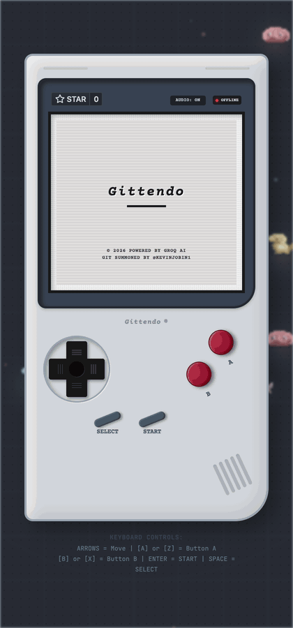

<p align="center">
  
</p>

<p align="center">
  <a href="https://github.com/kevinjobin1/Gittymon/actions/workflows/ci.yml">
    
  </a>
  <a href="https://codecov.io/gh/kevinjobin1/Gittymon">
    
  </a>
</p>

<p align="center">
  <strong>Turn any GitHub profile into a savage 8-bit Roast-mon monster — battle bugs, fight AI bosses, and climb the leaderboard. All inside a faithfully recreated Nintendo GBA SP clamshell console.</strong>
</p>

<p align="center">
  <a href="#visual-overview">Visual Overview</a> •
  <a href="#features">Features</a> •
  <a href="#quick-start">Quick Start</a> •
  <a href="#api-endpoints">API</a> •
  <a href="#embed-cards">Embed Cards</a> •
  <a href="#architecture">Architecture</a>
</p>

<br />

---

## Visual Overview

Gittymon wraps its entire experience inside a pixel-perfect recreation of the **Game Boy Advance SP** — right down to the clamshell hinge, d-pad texture, and boot animation. It's not a skin; it's a fully interactive hardware simulation rendered in CSS.

### The Console

| Element | Detail |
|---------|--------|
| **Shell** | Silver-gray clamshell with top screen + bottom controls, hinged connector |
| **Screen** | Gray LCD bezel with active scanline overlay, anti-glare inner shadow |
| **Boot** | Animated logo drop + camera rack-focus on load; authentic 2.6s boot sequence |
| **D-pad** | Ribbed cross with circular indent — full key-down feedback on press |
| **A/B** | Crimson buttons with inset shadows, angled right-side layout |
| **START/SELECT** | Rounded gray pills below the speaker grill |
| **Speaker** | Dot-pattern grill with physical depth shading |
| **Zoom** | Click console to expand; use +/- to zoom 50–300%; ESC to collapse |
| **Controls** | ? button opens a modal listing all keyboard bindings |

### Interactive Background

Outside the console, a full-screen **animated canvas** runs in the background — it's a living ecosystem of procedural pixel creatures and cosmic debris:

- **14 roaming monsters** (Repo-Rex, Bug-Slime, Octo-Branch, Beta-Bat) wander the screen with 2-frame walking/idle animation cycles
- **Click anywhere** to send monsters scattering in panic with jumping physics, speech bubbles, and spark particle bursts
- **Mouse tracking** overlays a radar-style HUD crosshair with hex coordinate readouts
- **Drifting code particles** float endlessly — git commands, JS snippets, and npm incantations
- **Parallax grid** subtly shifts when the console is expanded, with a deep-space starfield backdrop
- **Log notifications** animate in from the left when you click on a monster — each shows a random developer quip

### Screen Flow

<p align="center">
  
  <br />
  <em>Splash → Enter username → Summon → Monster stats → Battle — the full loop</em>
</p>

<br />

| Screen | What You See |
|--------|--------------|
| **Splash** | Animated card preview for `@octocat` + text input for GitHub username |
| **Summoning** | Scrolling terminal logs + 10-segment stability progress bar |
| **Hub** | 8-option menu with cursor, active monster banner, online player count |
| **Stats** | Sprite viewer (click to cycle color palettes), 3-tab panel: Roast / Stats / Moves |
| **Battle** | Enemy-top/Player-bottom layout, animated sprites, typewriter narration, flashing HP bars |
| **PvP Lobby** | Online player count, matchmaking spinner with VS symbol, idle player list |
| **PvP Battle** | WebSocket-driven real-time combat with logs, sync state, forfeit option |
| **AI Boss** | CYBER-DRAKE-Y2K boss sprite, live Groq-generated roast commentary per turn |
| **Leaderboard** | Scrollable top-50 rankings with avatar, W/L record, medal coloring |
| **History** | Roast-dex registry with sprite preview card, delete entry |
| **Export** | 13 export formats + live animated card preview with auto-copy on summon |

### Animations & Transitions

Every screen change is animated:
- **View enter/exit**: Vertical slide + fade (220ms / 160ms)
- **Battle enter**: Flash + scale bounce + shake (420ms)
- **HP damage**: Red flash overlay on the damaged HP bar (350ms)
- **Camera focus**: Rack-focus blur-to-sharp on boot complete (800ms spring)
- **Camera flash**: Vintage shutter click with white flash on battle entry
- **Logo drop**: Overshoot bounce for the "Gittendo" boot logo

---

## Features

| Feature | Description |
|---------|-------------|
| **GBA SP Console** | Authentic clamshell chassis with D-pad, A/B buttons, hinge, boot sequence, scanline overlay |
| **Interactive Background** | Roaming pixel monsters, click-to-scatter, mouse tracking, code particles, dev-log notifications |
| **Summon System** | Enter a GitHub username → fetches profile data → AI generates a custom monster with stats, moves, and a savage roast. Cached to disk so repeated lookups skip the AI. |
| **Local Battle** | Fight procedurally generated bug monsters (Merge Conflict, Null Pointer, Out of Memory, etc.) with turn-based combat |
| **PvP Arena** | Real-time WebSocket multiplayer. Sarcastic retro bots fill in when no opponent is found. Leaderboard tracks win/loss records. |
| **AI Boss Battle** | Face "CYBER-DRAKE-Y2K" (LV 99 Arch-Glitch) — every turn hits the Groq API for a dynamically generated roast commentary |
| **Procedural Pixel Art** | Seeded LCG pixel-art generator — every username produces a unique monster sprite with variable horns, eyes, limbs, and body shapes |
| **Chiptune Audio** | Real-time Web Audio API generative chiptune engine — switches between normal and battle-intensity patterns with kick/snare percussion |
| **Embed Cards** | Export your Roast-mon as SVG, animated GIF, or PNG card. 13 embed formats including shields.io badge, BBCode, inline SVG, and social share page |
| **Leaderboard** | Preseeded with coding legends (Woz, Torvalds, Lovelace, Hamilton, Gosling). New challengers auto-added on match results. |
| **Summon Cache** | Repeated lookups for the same GitHub username serve the cached result instantly — no AI or GitHub API call |
| **Shields.io Badge** | Dynamic badge endpoint showing rank and level for any username — embeddable in GitHub profiles |

---

## Quick Start

### Prerequisites

- **Node.js** 18+
- A free **Groq API key** from [console.groq.com](https://console.groq.com) (free tier: ~14k requests/day, Llama 3.3 70B + Llama 3.1 8B)

### Setup

```bash
# 1. Clone & install
git clone https://github.com/kevinjobin1/Gittymon.git
cd Gittymon
npm install

# 2. Create .env with your Groq API key
echo 'GROQ_API_KEY="gsk_your_key_here"' > .env

# 3. Run
npm run dev
```

The app starts at **`http://localhost:3000`**.

### Environment Variables

| Variable | Required | Description |
|----------|----------|-------------|
| `GROQ_API_KEY` | Yes | Groq API key for Llama 3 AI generation |
| `APP_URL` | No | Public URL for self-referential links (auto-injected on AI Studio) |

### Scripts

| Command | Description |
|---------|-------------|
| `npm run dev` | Start dev server with hot-reload (uses `tsx`) |
| `npm run build` | Build Vite frontend + bundle server with esbuild |
| `npm start` | Run production server from `dist/` |
| `npm run lint` | TypeScript type-check (`tsc --noEmit`) |

---

## Tech Stack

| Layer | Technology |
|-------|-----------|
| **Frontend** | React 19, TypeScript, Tailwind CSS v4, Vite 6 |
| **Server** | Express.js, `tsx` (dev), esbuild (production bundle) |
| **AI** | Groq API (Llama 3.3 70B for summon JSON, Llama 3.1 8B for boss roasts) |
| **Real-time** | WebSocket via `ws` library |
| **Audio** | Web Audio API — procedural chiptune synthesis with kick/snare percussion |
| **Sprites** | Procedural pixel art (canvas 2D), seeded LCG randomness |
| **Cards** | Canvas card renderer, `gifenc` for animated GIF export |
| **Animations** | CSS3 keyframes (scanlines, boot, camera focus, HP flash, battle shake, view transitions) + `motion/react` for notification overlays |
| **Fonts** | Space Mono, JetBrains Mono, Courier Prime |

---

## API Endpoints

### `POST /api/summon`
Summon a Roast-mon from a GitHub username.

```json
{ "username": "octocat" }
```

Use `{ "username": "octocat", "refresh": true }` to bypass the cache and regenerate.

### `GET /api/leaderboard`
Returns the full leaderboard sorted by wins descending (top 50).

### `POST /api/ai-boss-comment`
Generates a dynamic roast from the AI boss during battle.

```json
{
  "username": "octocat",
  "monName": "CommitoBat",
  "stats": { "hp": 80, "attack": 65, "defense": 50, "speed": 70, "chaos": 40 },
  "action": "FIGHT: Git Commit Force",
  "bossHP": 200
}
```

### `GET /api/embed/svg/:username`
Returns an SVG card (460x220) with sprite, stats, and roast.

```markdown

```

### `GET /api/embed/gif/:username`
Returns an animated GIF version of the card (460x220, 10 frames, sprite bounce + typewriter roast).

```markdown

```

### `GET /api/badge/:username`
Returns a shields.io compatible JSON endpoint for dynamic badges.

```
https://img.shields.io/endpoint?url=https://your-app.com/api/badge/octocat&style=for-the-badge
```

### `GET /card/:username`
Full HTML page with Open Graph / Twitter Card meta tags. Designed for social sharing.

---

## Embed Cards

Add your summoned Roast-mon to any GitHub README or website:

| Format | Code |
|--------|------|
| **Animated GIF** | `` |
| **Static SVG** | `` |
| **Dynamic Badge** | `` |

### Live Example — @kevinjobin1

| SVG Card | Animated GIF Card |
|:---:|:---:|
|  |  |
| **Forknado** — LV 24 LowFollower | Bouncy sprite + typewriter roast — 1.6s loop |

### Live Badge

<p align="center">
  <a href="https://github.com/kevinjobin1">
    
  </a>
</p>

---

## Controls

| Key | Action |
|-----|--------|
| **Arrow keys** | D-pad navigation (menu, battle cursor) |
| **Z** or **A** | Button A (confirm, select) |
| **X** or **B** | Button B (back, cancel) |
| **Enter** | START button |
| **Space** or **Shift** | SELECT button |
| **ESC** | Collapse expanded console |
| **Click console** | Expand to fill viewport with dynamic zoom |
| **Console +/-** | Zoom in/out after expansion (50–300%) |

---

## Architecture

```
Gittymon/
├── server.ts              # Express + AI endpoints + Vite middleware
├── server/
│   ├── leaderboard.ts     # Leaderboard CRUD (persisted to disk)
│   ├── multiplayer.ts     # WebSocket PvP matchmaking + bot AI + combat engine
│   └── embed.ts           # SVG + animated GIF card generators
├── src/
│   ├── App.tsx            # Screen routing, WebSocket, state management
│   ├── main.tsx           # React entry point
│   ├── components/
│   │   ├── ConsoleShell.tsx    # GBA SP clamshell chassis (D-pad, buttons, boot, zoom)
│   │   ├── BackgroundMap.tsx   # Full-screen animated canvas (monsters, particles, interactivity)
│   │   ├── SplashView.tsx      # Landing screen with animated card preview
│   │   ├── SummoningView.tsx   # Animated summon loading (terminal logs + progress bar)
│   │   ├── HubView.tsx         # Main menu with cursor navigation
│   │   ├── BattleArenaView.tsx # Single-player turn-based bug battle
│   │   ├── AiBossBattleView.tsx# AI boss battle with live Groq commentary
│   │   ├── PvpLobbyView.tsx    # Matchmaking lobby
│   │   ├── PvpBattleView.tsx   # WebSocket PvP battle
│   │   ├── MonDetailsView.tsx  # Stats / moves / roast inspection with palette cycling
│   │   ├── LeaderboardView.tsx # Top 50 rankings
│   │   ├── HistoryView.tsx     # Previously summoned monsters
│   │   └── ExportEmbedView.tsx # 13 export formats + live canvas preview
│   ├── utils/
│   │   ├── procGen.ts     # Procedural pixel-art sprite generator
│   │   ├── audio.ts       # Chiptune engine (Web Audio API)
│   │   └── cardRenderer.ts# Canvas-based card renderer
│   ├── types.ts
│   └── index.css          # Tailwind + custom keyframes + shell styles
├── leaderboard.json
├── summon-cache.json
└── package.json
```

---

## Deployment

### Cloudflare Workers (Recommended)

```bash
npm run build
npx wrangler deploy
```

Set `GROQ_API_KEY` and `APP_URL` as Cloudflare Workers secrets:
```bash
npx wrangler secret put GROQ_API_KEY
npx wrangler secret put APP_URL
```

### Manual

```bash
npm run build
GROQ_API_KEY="gsk_..." node dist/server.cjs
```

---

## Data Files

| File | Purpose |
|------|---------|
| `leaderboard.json` | Win/loss records. Preseeded with 5 coding legends. Auto-created if missing. |
| `summon-cache.json` | AI-generated monster cache by username. Max 500 entries. Pass `refresh: true` to bypass. |
| `example-card.svg` | Example SVG card for @kevinjobin1 — preview without running the app |
| `example-card.gif` | Example animated GIF card for @kevinjobin1 |
| `screencast.gif` | Full app flow screencast (splash → type → summon → result) |
| `banner.png` | README header banner |
| `social-preview.png` | Open Graph share image (1280x640) |

---

## License

MIT — [kevinjobin1/Gittymon](https://github.com/kevinjobin1/Gittymon)
